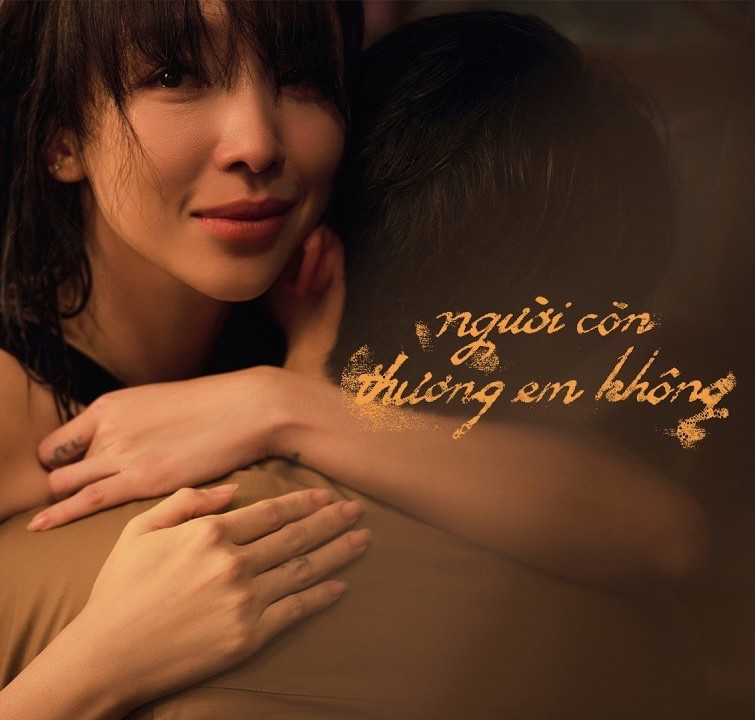
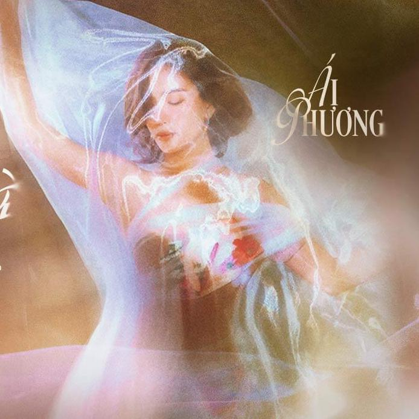
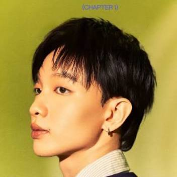

<!-- HEADER START -->

  
   
  <i>
    <b>Chiêng làng chiêng chạng Thượng hạ tây đông   Mấy thời xuân sắc  Má đỏ môi trầu   Mầu tui lên chùa   Xin một quẻ câu duyên </b>
  </i>

---

<!-- HEADER END -->

# 💫 About Me

🎮 Game Developer

🌿 Environment & Visual Development

💡 Passionate about crafting immersive worlds and meaningful player experiences.

📬 **Reach me at**

---

# 💻 Tech Stack & Tools

---

# 📅 Contribution Calendar

---

# 👀 Profile Views

---

# 📊 GitHub Analytics

---

# 🕹️ Featured Projects

---

# 📈 Languages & Activity

<table align="center">

<tr>

<td width="50%">

</td>

<td width="50%">

</td>

</tr>

</table>

---

#🎧 My loved singers 🩷

